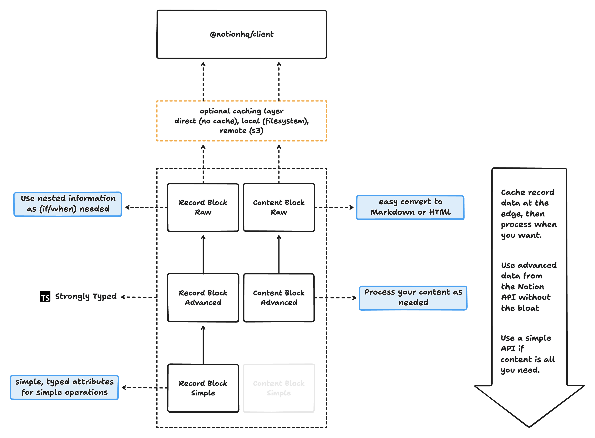

# Notion CMS Monorepo



## Development

To develop all apps and packages, run the following command:

```
npm run dev
```

## Build

To build all apps and packages, run the following command:

```
npm run build
```

## Lint

To lint all apps and packages, run the following command:

```
npm run lint
```
